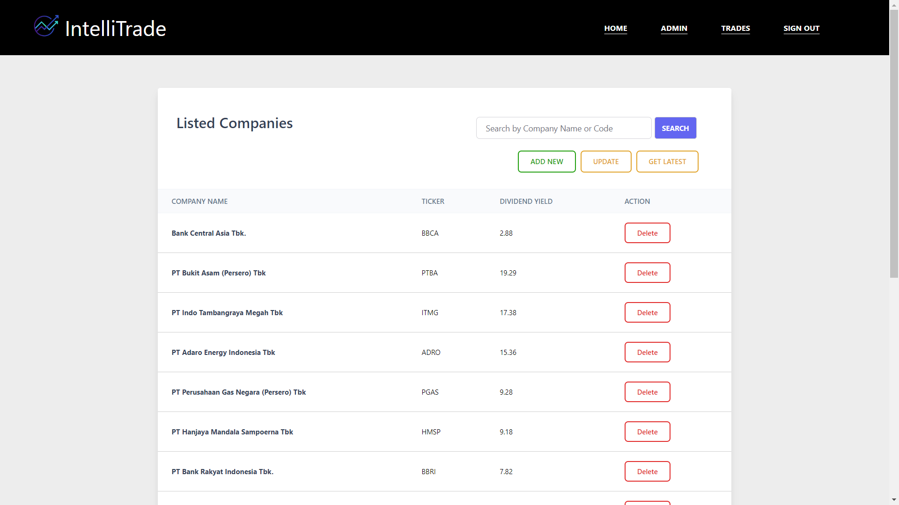
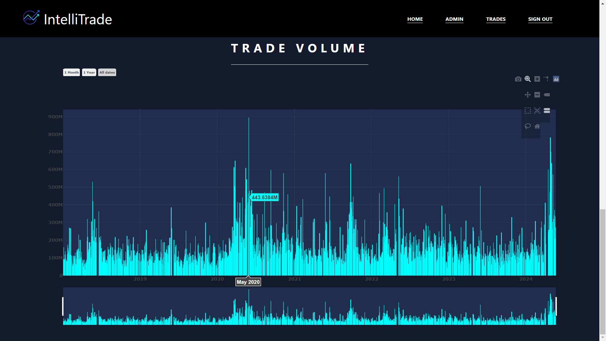

# IntelliTrade

📆 `Project Completion: 24 May 2024`

IntelliTrade is a mini software solution prototype tailored for stock broker companies, designed to streamline and enhance the trading experience for both brokers and entry-level investment stakeholders in the Indonesia Stock Exchange (IDX). The platform offers an intuitive interface where users can access detailed company profiles, real-time volume, and historical data of listed companies. Users can place buy or sell orders at specified prices with defined expiry dates. Brokers - administrators then process these transactions, and maintaining archive of completed orders for all users. Leveraging automated data fetching capabilities from an IDX API provider, IntelliTrade ensures up-to-date market information at the touch of a button, eliminating manual effort and enhancing decision-making efficiency.

 
 

# Table of Contents
1. [Feature Overview](#Features)

2. [Application Snapshots](#Application-Snapshots) 

3. [Tech Stack](#Tech-Stack)

4. [Issues and Challenges](#Issues-and-Challenges)

5. [Installation](#Installation)
 
 

# Feature Overview

The project includes the following features and their corresponding functions.

| End-User      | Feature Offered                 |
|---------------|-------------------------------|
| Administrator     | Create new user, update user-role, add / list new company, update listed company dividend yield, synchronize historicals and volumes data. |
| Broker    | View all market orders, process or terminate orders. |
| User | View listed company profiles, historicals, and volumes data. Create buy order and put sell order on specified limit price and expiration date.            |

 
 

# Application-Snapshots

#### `Landing Page of IntelliTrade`

#### `Homepage`

#### `Admin View : Listed Companies`

#### `Admin View : User Management`

#### `Broker View : Market Orders`

#### `User View : Market Listings`

#### `User View : Market Details`

#### `User View : Portfolios`

 
 
 

# Tech-Stack
 

IntelliTrade project is constructed based on the principle of server-side rendering, aligning with the current focus of my learning endeavors. In its completion, the project utilizes a tech stack comprising Express.js for backend routing, PostgreSQL as the database management system, and Sequelize ORM for data modeling. I also utilized Axios library to manage requests to third-party APIs and Plotly charting library to create interactive data visualizations.

| Framework - Library |
|---------------------|
| EJS                 |
| Express.js          |
| Express-session     |
| Postgresql          |
| Sequelize ORM       |
| Axios               |
| Bcrypt              |

 
 

# Issues-and-Challenges
 

Using Sequelize ORM often feels like navigating a labyrinth of intricacies, where the path to smooth database operations is obscured by pitfalls and challenges. The documentation, while extensive, sometimes lacks clarity, leaving users stranded in a sea of ambiguity when attempting to troubleshoot errors or implement advanced features.

Another issue i encountered and proofs to be a source of concern is relying on data fetched from third-party APIs for cost and service reliability introduces a precarious balancing act between dependency and uncertainty. The challenge lies in the inherent volatility of external sources, where fluctuating prices and unpredictable performance can disrupt the smooth operation of systems and services. Integrating such data demands meticulous error handling and fallback mechanisms to mitigate the risks of downtime or inaccuracies. 

 
 

# Installation

### 1.  Clone the repository
    git clone https://github.com/Alexwilliam112/intelliTrade.git

### 2.  Install necessary dependencies
    npm install

### 3.  ENV setup for API
#### This is not required. Not following step-3 will only disables the home news

    --> get your API keys from https://goapi.io/

    --> go to the file .env.template

    --> replace it with your API key

### 4.  Run the application

    npm start

#### open your browser and navigate to
    http://localhost:3002/